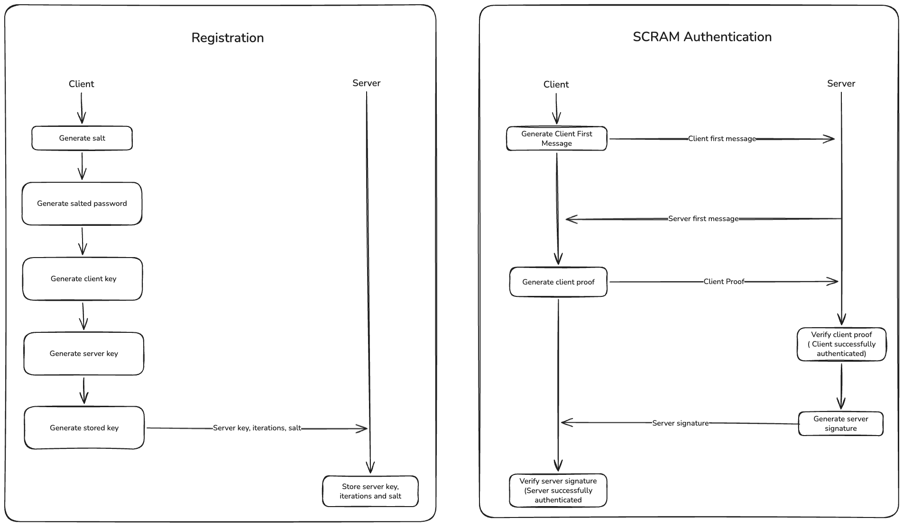

# Basic SCRAM implementation

This is a basic SCRAM implementation following RFC 5802     

## Notes: 

- This implementation will use http as a transport protocol,
so SASL related things ill we omitted.

- The SCAM rfc only defines the authentication mechanism, and not
the registration. The implementation of registration is up to the developer.
In the diagram file I'll visialise how the registration will happen, aswell
as the SCRAM algorithm itself.

## Scram features

SCRAM provides the following protocol features:

-  The authentication information stored in the authentication
  database is not sufficient by itself to impersonate the client.
  The information is salted to prevent a pre-stored dictionary
  attack if the database is stolen.

-  The server does not gain the ability to impersonate the client to
  other servers (with an exception for server-authorized proxies).

-  The mechanism permits the use of a server-authorized proxy without
requiring that proxy to have super-user rights with the back-end
  server.

-  Mutual authentication is supported, but only the client is named
  (i.e., the server has no name).

-  When used as a SASL mechanism, SCRAM is capable of transporting
  authorization identities (see [RFC4422], Section 2) from the
  client to the server.

## Implementation details

### Definitions:

Salt := Random 24 byte string (base64 encoded)

SaltedPassword := PBKDF2(password, salt, i)

ClientKey := HMAC(SaltedPassword, "Client Key")

StoredKey := SHA256(ClientKey)

Nonce := Random 24 byte string (base64 encoded)

ClientFirstMessage := email, nonce

ServerFirstMessage := iterations, salt, fullNonce

AuthMessage := 'email,fullNonce,salt,iterations,fullNonce'
(important: This is different than the RFC definition since 
the implementation is for HTTPs rather than SASL)

ClientSignature := HMAC(StoredKey, AuthMessage)

ClientProof := XOR(ClientKey, ClientSignature)

ServerKey := HMAC(SaltedPassword, "Server Key")

ServerSignature := HMAC(ServerKey, AuthMessage)

### Registration and Authentication algorithms

